# PagePal Frontend

PagePal Frontend is a Next.js 15 application for a social reading platform. It supports book discovery, reviews, collections, social follow relationships, author workflows, and admin moderation.

The UI is built with a mobile-first shell and a themed design system, while data/state flows through Redux Toolkit and RTK Query.

## Table of Contents

- [Project Overview](#project-overview)
- [Related Backend Project](#related-backend-project)
- [Tech Stack](#tech-stack)
- [Architecture](#architecture)
- [Feature Implementation Snapshot](#feature-implementation-snapshot)
- [UI Gallery](#ui-gallery)
- [Route Map](#route-map)
- [Project Structure](#project-structure)
- [Getting Started](#getting-started)
- [Environment Variables](#environment-variables)
- [Available Scripts](#available-scripts)
- [Current Status Notes](#current-status-notes)

## Project Overview

PagePal Frontend is organized around role-aware reading experiences:

- Readers discover books, rate/review them, and manage personal/shared collections.
- Users can follow/unfollow people, browse followers/following, and get social suggestions.
- Authors can apply for author access, then create/edit/delete books.
- Admin users can review and approve/reject author applications.
- All users can switch visual themes that persist via cookies.

## Related Backend Project

This frontend is designed to work with the PagePal Postgres backend API. The backend provides auth, role-aware access, social graph endpoints, collections, reviews, and recommendation responses consumed by RTK Query in this app.

Backend GitHub link: [Add backend repository URL](https://github.com/your-username/pagepal-postgres)

## Tech Stack

| Category           | Tools                                             |
| ------------------ | ------------------------------------------------- |
| Framework          | Next.js 15 (App Router), React 19                 |
| Language           | TypeScript (strict mode)                          |
| Styling/UI         | Tailwind CSS v4, HeroUI, custom UI components     |
| State Management   | Redux Toolkit, Redux Persist                      |
| Data Fetching      | RTK Query (auth API + modular PagePal API slices) |
| Forms & Validation | React Hook Form, Zod, @hookform/resolvers         |
| Icons & Motion     | Tabler Icons, Framer Motion                       |
| Quality Tooling    | ESLint 9, eslint-config-next                      |

## Architecture

### 1) App Router + Screen Composition

- Route files under `src/app/**/page.tsx` are thin wrappers.
- Most routes render domain screens from `src/components/screens`.
- Authentication pages (`/login`, `/register`, `/forgot-password`) are route-level client pages.

### 2) Shared Layout and Navigation

- `AppShell` provides a consistent desktop sidebar + mobile bottom-tab shell.
- Navigation visibility is role-aware (`USER`, `AUTHOR`, `ADMIN`) via `useRole`.
- Each screen uses a zone (`A` to `E`) to drive visual treatment and page identity.

### 3) API Layer and Data Contracts

- `authApi` handles login/register/logout.
- `pagepalApi` is the root RTK Query API with tag types and endpoint injection.
- Domain endpoint modules:
  - `pagepalUserApi`
  - `pagepalBookApi`
  - `pagepalCollectionApi`
  - `pagepalAuthorApi`
  - `pagepalAdminApi`
- `pagepalContracts` maps backend payloads into frontend domain models (`mapBook`, `mapUser`, `mapCollection`, `mapReview`).

### 4) Session/Auth Strategy

- Access token is stored in Redux user state and persisted with `redux-persist`.
- API requests attach `Authorization: Bearer <token>` when available.
- 401 responses trigger automatic refresh-token flow (`/auth/refresh-token`) in `baseQueryWithReauth`.
- Refresh uses `credentials: include`, expecting a cookie-based refresh session.

### 5) Theme System

- Global CSS tokens and multiple preset themes are defined via CSS variables.
- Theme metadata lives in `src/data/theme.ts`.
- Theme changes call `/api/theme` and persist a `mode` cookie.
- Root layout reads the cookie and applies the selected theme class server-side.

## Feature Implementation Snapshot

| Feature                          | What Users Get                                                                            | Implementation (short)                                                                                    |
| -------------------------------- | ----------------------------------------------------------------------------------------- | --------------------------------------------------------------------------------------------------------- |
| Auth and onboarding              | Sign in, register, logout                                                                 | Next.js client routes + React Hook Form + Zod + `authApi` mutations + Redux user slice                    |
| Token refresh session continuity | Reduced forced logouts on expired access token                                            | RTK Query custom `baseQueryWithReauth`, refresh endpoint retry, `updateToken` action                      |
| Home feed and shelf actions      | Personalized recommendations and quick add-to-shelf                                       | `useGetRecommendationsQuery`, `useGetMyCollectionsQuery`, bottom sheet interactions, optimistic UX toasts |
| Discover and filtering           | Search by term, genre, author, year, and tags                                             | Debounced input hook, filtered query params, tag chips, reusable `BooksGrid`                              |
| Book detail and engagement       | View metadata, rate, review, add to collection, share                                     | Book/review/rating queries + review composer form + collection mutation flows + Web Share API fallback    |
| Collection management            | Create/edit/delete collections, add/remove books, change reading status, share with users | Collection endpoint slice, reusable collection form, `UserSearchPicker`, status chips, ownership checks   |
| Social graph                     | Follow/unfollow/remove follower, suggestions, user search                                 | Follow mutations + follower/following paginated queries + reusable follow components                      |
| Profiles                         | Personal profile editing and public user profile views                                    | Me/user queries, profile edit form with schema validation, role/follow indicators                         |
| Author workflows                 | Apply to become author, manage authored books                                             | Role-gated screens, author application endpoint, book CRUD forms for author/admin roles                   |
| Admin moderation                 | Review pending author applications and approve/reject with reason                         | Role-gated admin desk, status filtering, reject reason schema, admin review mutation                      |
| Appearance personalization       | Theme switching with persistence                                                          | Theme palette data + apply utility + cookie-backed Next.js API route                                      |

## UI Gallery

The screenshots below are grouped by flow so the visual tour stays scan-friendly while still covering all screens in images/.

### Reader Home and Shelf

| Home recommendations (mint) | Shelf view (coffee) | Shared collections |
| --- | --- | --- |
| 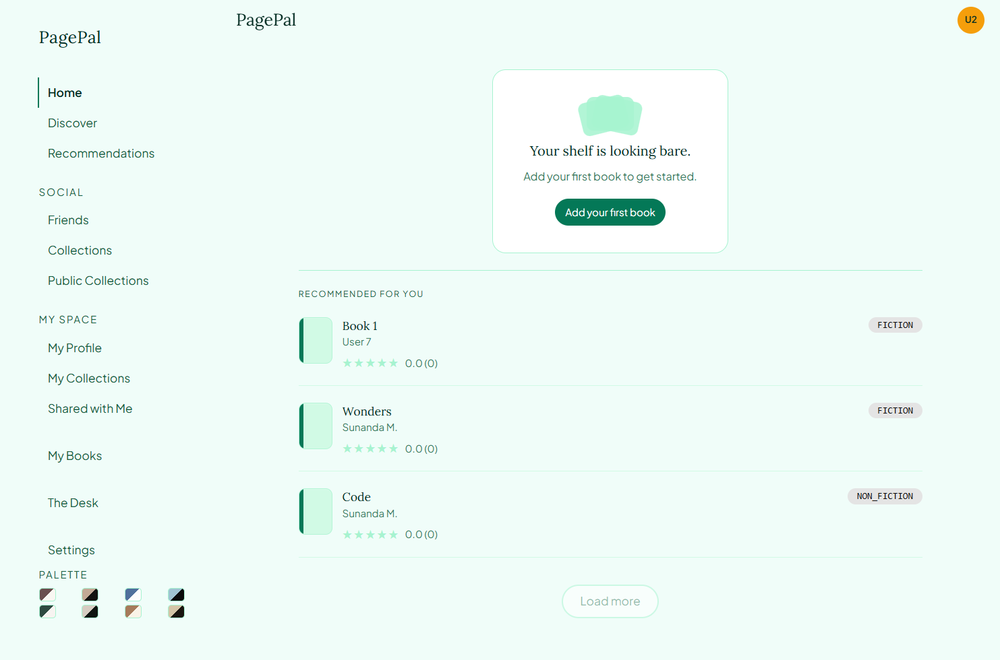 | 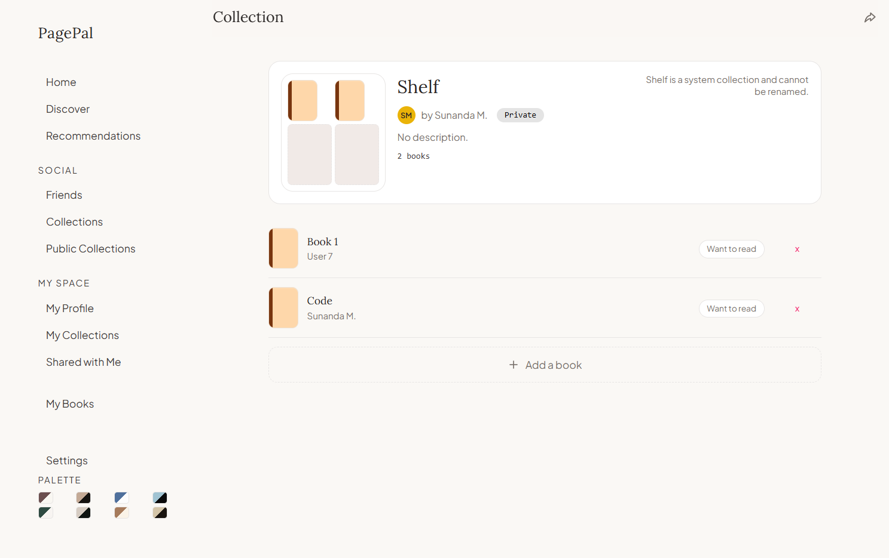 | 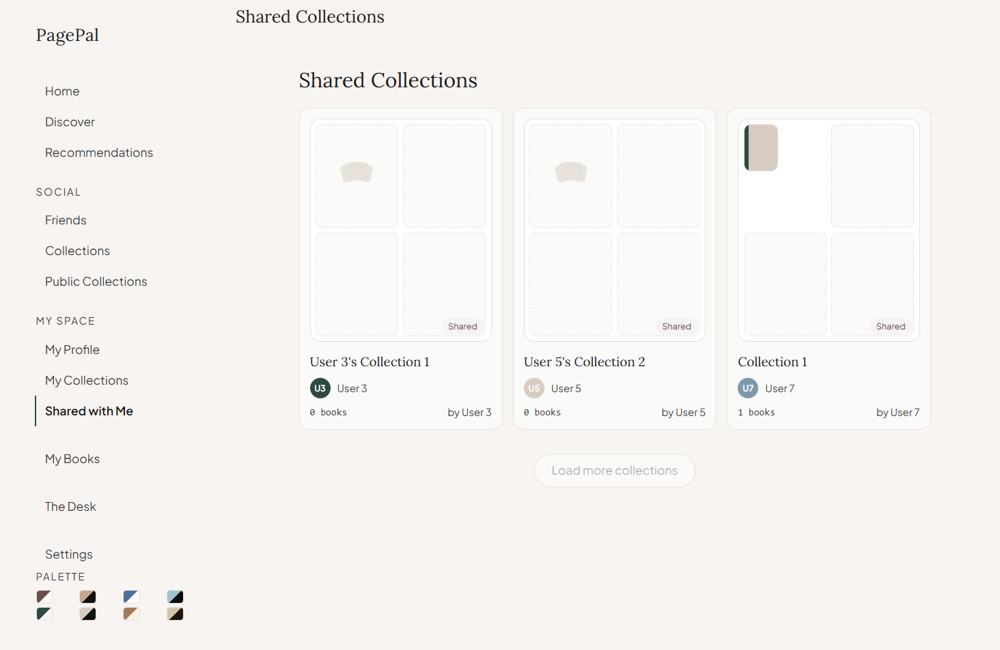 |

### Collections and Social

| Public collections (mobile) | Following (mobile coffee) | Following (desktop forest) |
| --- | --- | --- |
| 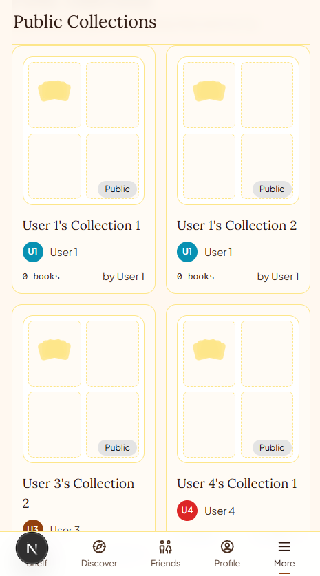 | 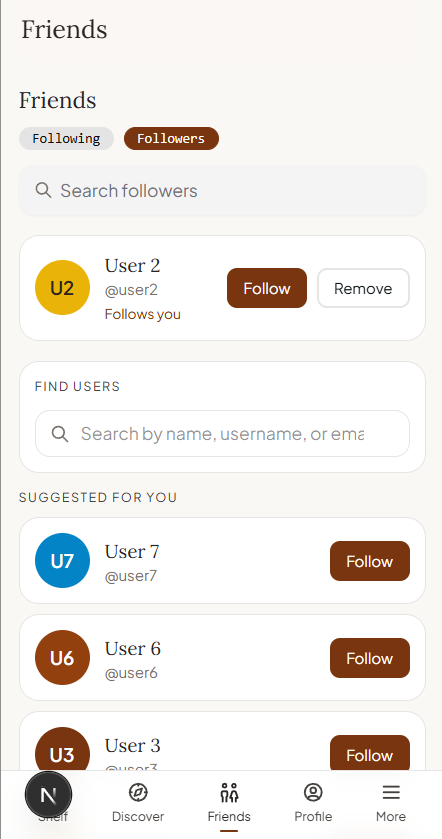 | 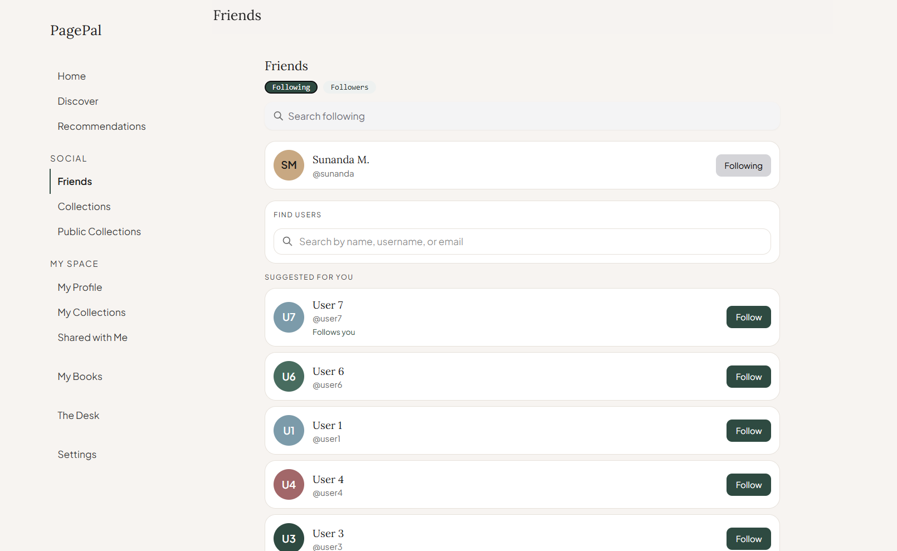 |

### Settings and Account

| Settings (desktop library) | Settings palette (mobile library) | Register password step (mobile mint) |
| --- | --- | --- |
| 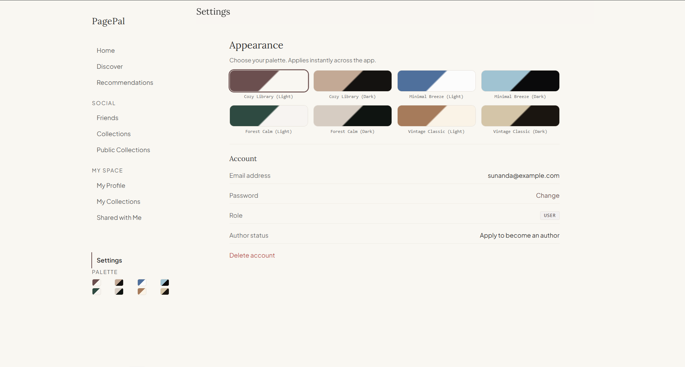 | 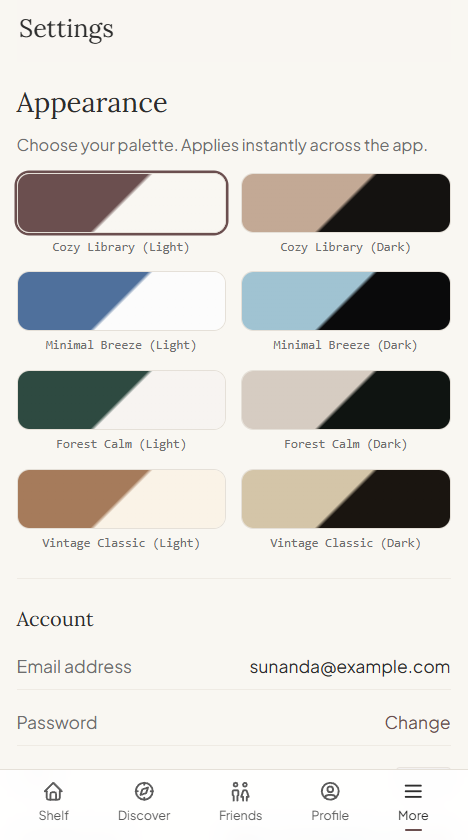 | 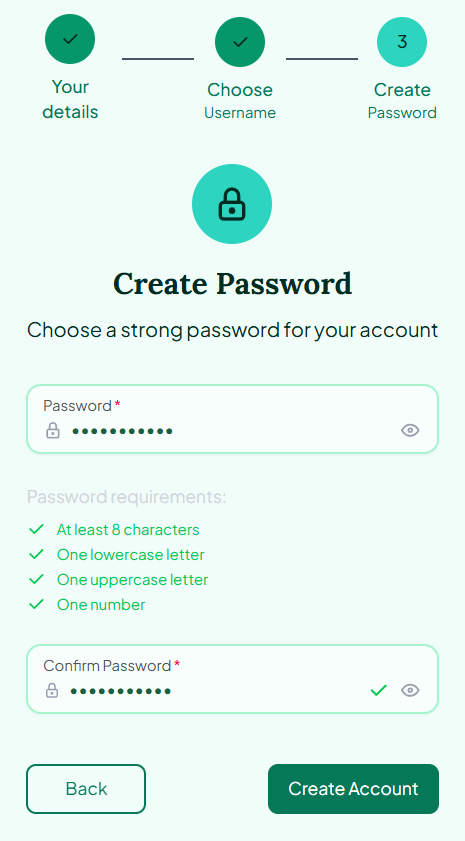 |

### Author and Admin Workflow

| Author apply (blossom) | Pending application (dark) | Application approved |
| --- | --- | --- |
| 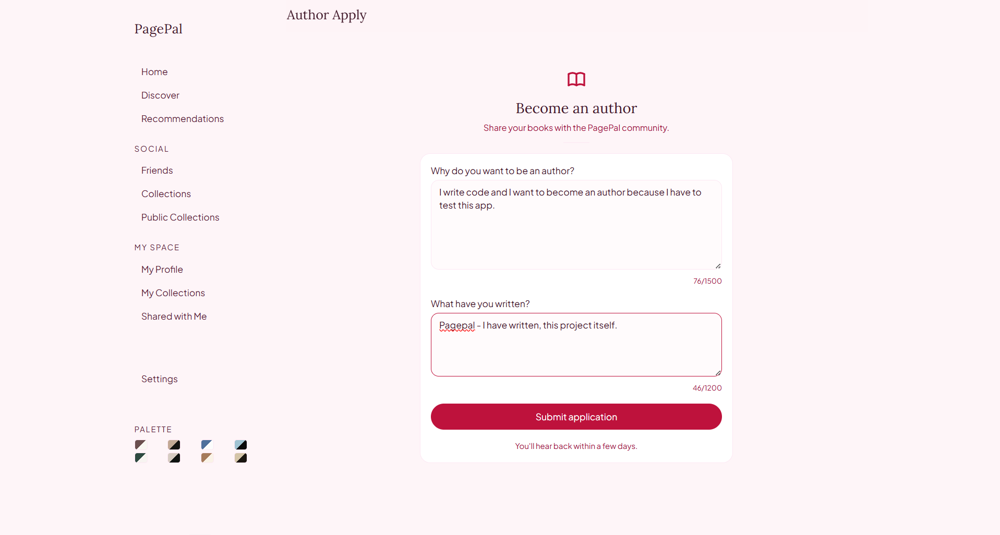 | 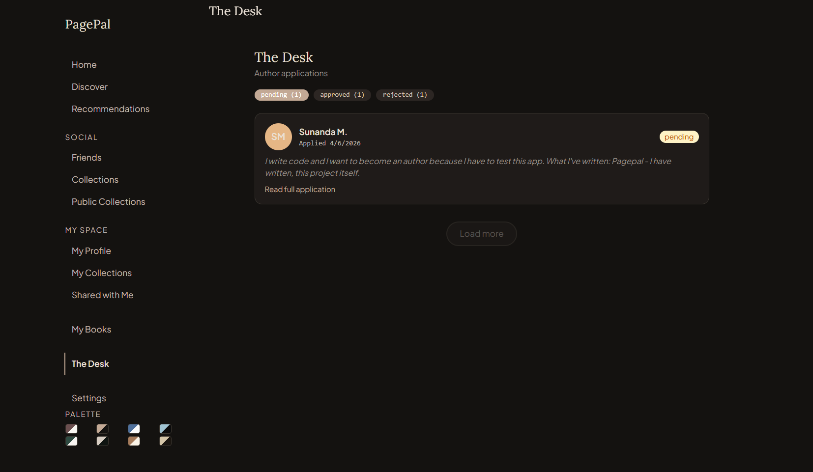 | 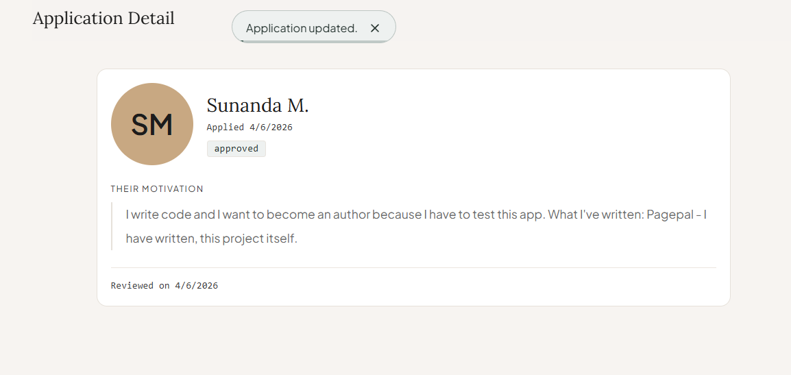 |

### Review and Book Management

| Application detail (coffee) | My books list | New book form |
| --- | --- | --- |
| 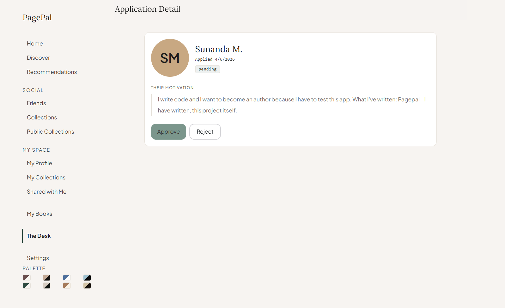 | 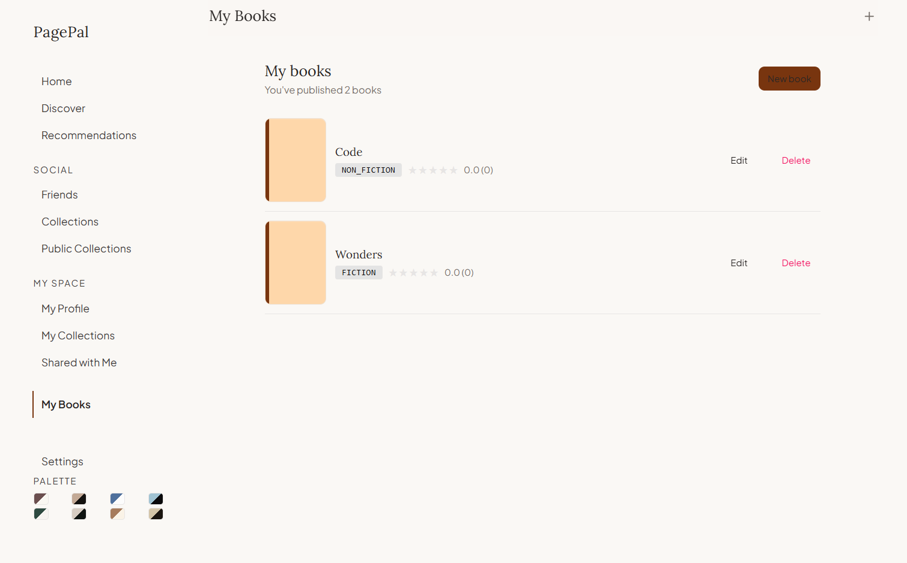 | 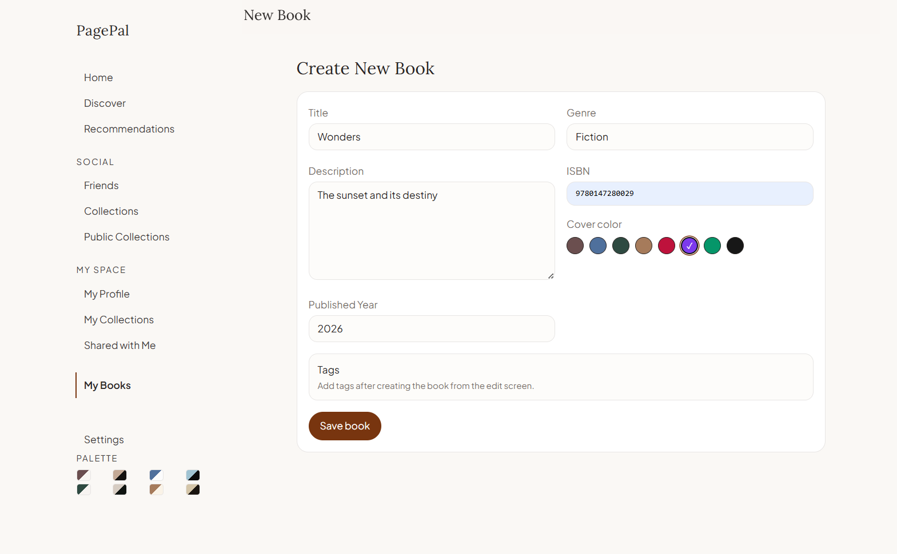 |

## Route Map

### Core

- `/` Home feed
- `/discover` Discovery and filtering
- `/discover/recommendations` Recommendation list
- `/books/[id]` Book detail
- `/books/[id]/reviews` Full reviews view

### Collections

- `/collections/me`
- `/collections/public`
- `/collections/shared`
- `/collections/new`
- `/collections/[id]`
- `/collections/[id]/edit`

### Social and Profiles

- `/friends`
- `/profile/me`
- `/profile/me/edit`
- `/profile/[id]`
- `/authors/[id]`
- `/tags/[id]`

### Author and Admin

- `/author/apply`
- `/author/apply/status`
- `/author/manage`
- `/author/manage/new`
- `/author/manage/[id]/edit`
- `/admin`
- `/admin/applications/[id]`

### Auth and Settings

- `/login`
- `/register`
- `/forgot-password`
- `/settings`
- `/theme`

## Project Structure

```text
pagepal-frontend/
	src/
		app/                    # Next.js App Router routes, layout, providers, API route
		components/
			screens/              # Route-level screen compositions by feature domain
			layout/               # Shared app shell/navigation
			forms/                # Reusable domain forms
			shared/               # Cross-screen feature widgets
			ui/                   # Reusable presentational primitives
		redux/
			apis/                 # RTK Query APIs (auth + domain slices)
			features/             # Redux slices (user/session)
			store.ts              # Store and persistence configuration
		schemas/                # Zod validation schemas
		hooks/                  # Reusable hooks (debounce, role, responsive, theme carousel)
		data/                   # Static lookup/palette data
		utils/                  # Utility helpers (theme/app behavior)
```

## Getting Started

### Prerequisites

- Node.js 20+
- npm 10+
- Running PagePal backend API (see sibling backend project)

### Install and Run

1. Install dependencies:

```bash
npm install
```

2. Create environment file:

```bash
# .env.local
NEXT_PUBLIC_BACKEND_URL=http://localhost:5000
```

3. Start development server:

```bash
npm run dev
```

4. Open:

```text
http://localhost:3000
```

## Environment Variables

| Variable                  | Required | Description                                    |
| ------------------------- | -------- | ---------------------------------------------- |
| `NEXT_PUBLIC_BACKEND_URL` | Yes      | Base URL for backend API consumed by RTK Query |

## Available Scripts

- `npm run dev` - Start Next.js dev server.
- `npm run build` - Build for production.
- `npm run start` - Start production server from built output.
- `npm run lint` - Run ESLint checks.

## Current Status Notes

The frontend is functionally broad, but several areas are currently placeholders or partially wired:

- Forgot-password flow currently validates form input but does not call a backend endpoint.
- Some views intentionally show placeholder states while backend endpoints are pending (for example, public profile shelves/review feed).
- Multiple "Load more" controls are UI placeholders and currently disabled.
- Settings account actions such as password change and delete account are UI-only at this stage.
